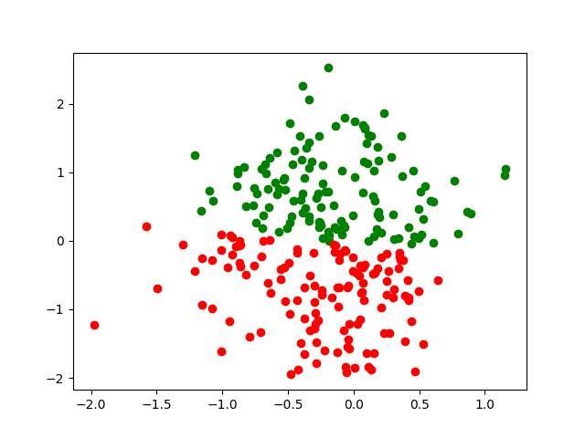
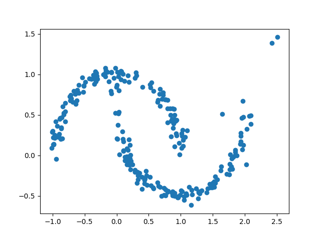

# **Classification using NFs**

## 1. Install dependencies
```bash
pip install -r requirements.txt
```

## 2. Gaussianize the moon dataset
```bash
python train.py --config <type>
```

\<type> can be selected from the `config.yaml` file (for e.g. master), which has all the hyperparameters.


### Check the `plots/sample` directory for gaussinization and inverse function plots.

## 3. Sample output
  * Gaussianized data

  

  * Reconstructed data

  
